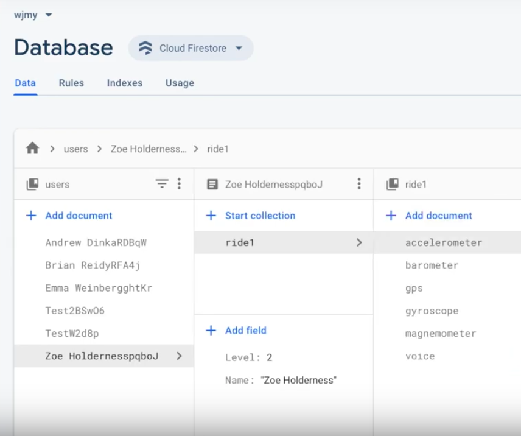
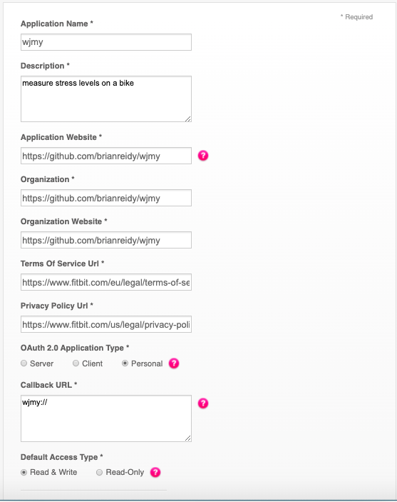

# wjmy

- [wjmy](#wjmy)
  - [Requirements](#requirements)
  - [Quick Start](#quick-start)
  - [What's Next?](#whats-next)
  - [Working with Fitbit's Web Api](#working-with-fitbits-web-api)
  - [Android Specific Problems](#android-specific-problems)
  - [Navigating The Code Base](#navigating-the-code-base)
    - [What's in src/arch](#whats-in-srcarch)
    - [What's in src/ui](#whats-in-srcui)
    - [What's in App.js](#whats-in-appjs)
  - [Adding/Editing Surveys](##adding/Editing-the-Surveys)

## Requirements 

Our current React-Native App was targeted for ios. Due to some issues getting android's deep-linking working which is explained later in the readme. So here is what you will need.

1. OS X - This repo only contains the iOS implementation right now, and Xcode only runs on Mac.
2. Dowwnload Xcode or if you have it already update it.  [Download it](https://developer.apple.com/xcode/downloads/) from the Mac App Store.
3. [Homebrew](http://brew.sh/) is the recommended way to install node, watchman, and flow.
4. [CocoaPods](https://cocoapods.org/) is an iOS dependency manager (Ruby will need to be installed to install CocoaPods)
5. New to node or npm? `brew install node`
6. We recommend installing [watchman](https://facebook.github.io/watchman/docs/install.html), otherwise you might hit a node file watching bug.  `brew install watchman`
7. [Clone](https://help.github.com/en/github/creating-cloning-and-archiving-repositories/cloning-a-repository) the repository
8.  *optional* [Android Studio](https://developer.android.com/studio) is useful for doing further native android development
9. *optional* [Configure Android's developer options to run on a physical device](https://developer.android.com/studio/debug/dev-options)

## Quick Start
Get started with our WJMY app:
1. Once you have the repo cloned and met all the non optional requirements above, Change directory to the cloned repository . In this case the cloned repository was in the Documents then slab folder.
```
 cd /Documents/slab/wjmy 
``` 
2. Open this project in the text editor of your choosing and add a file called `config.js` to the top level of the project(i.e. in `Documents/wjmy/config.js`). This is where the keys are stored for the fitbit api. MAKE SURE TO ADD THIS FILE TO THE GITIGNORE. Putting private keys in github is bad. If for some reason this file gets lost or you are the one handling the Fitbit api refer to the [Fitbit Api](#Fitbit-Api) section of this readme to learn how to set that up. 
3. Then install all of the packages required to run the project and start the metro bundler. npm install also runs a post install script that will change directory into the ios folder and install the respective pods as well. However this post script command doesn't run if you are adding a new specific package to the code. For example if you wanted to add a swipeable component. You would install the library in the wjmy folder by writing npm install 'react-native-swipeable' and then have to cd ios/ and run pod install. However, since we just running a global npm install we do not have to cd ios/ and install pods as it will do that automaticall.
```
npm install
npm start
``` 
4. We recommend that for the first time running the project you open the ios portion of it (i.e. /wjmy/ios) through xcode. In the top left icon there should be a simulator selected next to the project name. Then Click the play button. 
   1. After you run it from xcode you should be able to next time run the command below instead. If you ever run into the problem where you are only experiencing problems on android or ios specificially, we recommend running the code in the respective programs to receive more clear error messages
   ```
   npm run ios
   ```
## What's Next?
1. Reliable communication between the raspberry pi and the phone. 
   1. Tried experimenting with [react-native-ble-plx](https://github.com/Polidea/react-native-ble-plx)  and was able to detect several devices but never saw the raspberry pi. It was able to detect other devices just not the pi. The raspberry pi discoverability was turned on and the raspberry pi could be seen from the ios setting pages. The app just couldn't detect it. 
   2. Also tried setting up a NGINX web server on the raspberry pi and then making the pi into a router that the phone could connect to. The pi wouldn't be expected to connect to the internet it would just be able to transfer data between the pi and the phone through Wifi. For some reason, however, the NGINX webserver couldn't be started when the pi was acting like a router. 
   3. Another possible solution is if the android problems were fixed then it appears sending data over a cable is feasible. Ios locks this down to prevent malicious file transfer, but it appears android is able to. 
2. Post data processing. 
   1. All of the data is being stored in the [wjmy Firebase](https://console.firebase.google.com/u/0/project/wjmy-81588/database). The user meta data (level & name). Then in the ride collection there is all the sensor data (accelerometer, barometer, gps, gyroscope, magnemometer, and voice). 
3. Create a user login system. 
   1. Right now when a user puts their name in the app a unique id is associated with that name so each object in our database has a unique key associated with it. This means even if a user puts the same name their ride data will be not tied to a previous ride they made. If we had some type of login system then instead of creating a new user every time a new collection could be created every time preserving the riders meta data. However with this you have to be careful with what you store in the rider's metadata. A rider who is a confident bike rider today may not be confident after they got into a crash.
4. Upgrade React-Native
   1. In order stay up to date with the newest operating systems as well as capture the newest features of react-native you are going to have to upgrade. (In my experience this takes way longer than you'd expect so crack open a cold one and get to it.)
## Working with Fitbit's Web Api
   1. Fitbit code for the front end is handled in [getFitbitData.js](./src/ui/Results/getFitbitData.js)
   2. The fitbit keys are handled in a config.js file located in the top level of the project. As these keys are private this file will not show up by default. Create a `config.js` by yourself. Add this to your gitignore as this is private.
   3. Setup the fitbit api on the [Fitbit Dev Page](https://dev.fitbit.com/apps/new) Only one person will have to setup the api. However everyone who installs the app will need the config.js file.
   4. Here is what to enter on that new page: 
   
   1. I recommend changing the organization, application website and organization website. The code does not interact with these inputs and I assume at this point in time the code lies elsewhere. What is important is that callback URL `wjmy://` matchs. As this what goes in the browser and gets recognized by the os to route back to the app.
   2. This will give you a client id and a client secret. 
   3. Add them to the config.js file in this format. Notice both of the keys are in single quotes as these keys are strings make sure to keep them inside the single quotes.
   ```
   export default {
   client_id: 'CLIENT_ID_GOES_HERE',
   client_secret: 'SECRET_GOES_HERE',
   };
   ```
## Android Specific Problems
   1. The main android problem was with the fitbit api. Never was able to get it so that when wjmy:// was inputed to the browser it would get routed back to application and desposit all of the fitbit data. 
   2. [react-native-maps](https://github.com/react-native-community/react-native-maps) was never setup for android. 
      1. Right now we are using just the apple maps portion because it worked out of the box. However apple maps doesn't work on android. This could be worked around by setting up this library to function with google maps. This required setting up Google's api. Installation for react-native-map's google map support can be found [here](https://github.com/react-native-community/react-native-maps/blob/master/docs/installation.md).
   3. [react-native-voice](https://github.com/react-native-community/voice)that may have issues but were never tested on android because maps was not setup.
## Navigating The Code Base

```
wjmy
├── src 
│   ├── arch
│   │   ├── generateId
│   │   ├── setUpUser
│   └── ui
│   │   ├── Home
│   │   ├── InRide
│   │   ├── Results
├──App.js
│
```

These are the main files that you will need to modify besides if you are adding a library and it requires android or ios specific code to be added.

### What's in src/arch
generateId: is a function that generates a random number that gets associated with our user to make each object unique.

setUpUser is what gets called when you want to create a user in firebase.
### What's in src/ui
All three folders describe the screens that the user will see. Since there are 3 screens there are 3 folders. The navigation goes like this `Home -> InRide -> Results. ` Each folder has and index.js file this describes the main component. index.js files are nice because if you import the folder the index file will be imported by default. These folders also have helper functions/components that help keep the index files clean. 
### What's in App.js
This is where the navigation is handled. This project utilizes a library called react-navigation and its running version 5.0. Everytime a new screen needs to be added to the stack so say after the results page is done you want to have a screen showing all of the data on plots. You would have to create another directory in ui called DataResults create an index.js file with all the needed ui elements. Then you import that component into this app.js file like this
```
import DataResults from './src/ui/DataResults';

```
 and then add an element to the navigation stack for example: 
 ```
   <Stack.Screen name="DataResults" component={DataResults} />
```
for more infomation visit [react-navigation](https://reactnavigation.org/docs/getting-started)

## Adding/Editing the Surveys
Surey questions are stored in Google Firebase's Realtime database.
(https://console.firebase.google.com/project/wjmy-81588/database/wjmy-81588/data)
To add a new survey, click the plus by the word 'Surveys'. You can title this survey whatever you want, and a button will be populated on the In Ride page of the app for it. If you want the survey to be on the results page of the app, be sure to title the survey 'Post Ride'. 
To ensure that each survey populates correctly, click on the plus next to the name and to add an item. You can title this field whatever you want, (for example I've done 'Item1', 'Item2', 'Item3'). Once you've named this field, again click the plus button next to it and populate two more fields this time with the exact words 'Question' and 'Answer'. For the value for the 'Question' key, type your question. For the value for the 'Answer' key, type your answer choices separated by commas, (ie "option 1, option 2, option 3"). To edit the question or answer at any time simply click on the value, type the changes, and press enter. 